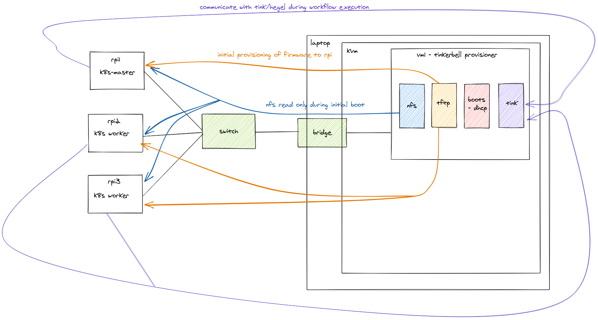

# Configuring Kubernetes cluster using tinkerbell

This repository contains an example tinkerbell (https://tinkerbell.org/) workflow for provisioning k8s control plane and
worker nodes on top of the raspberries pi version 4 (RPi4). 

## Introduction:

Tinkerbell is engine for provisioning bare metal servers, it helps users to build fully bootable and
operational machine from scratch. It can be used for any type of the machine from traditional 
x86_64 servers to arm based single-board computers. This repository contains step by step instruction, how 
leverage tinkerbell provisoning engine to build fully operational k8s cluster. It is assumed some familiarity 
with tinkerbell concepts in the below instruction. 

## Preparation:
### Setting local environment
In order to install tinkerbell locally we need to setup a virtual machine or a dedicated bare metal server. 
In the presented example the following setup was created: 


The lab consist of:
1) KVM+QEMU hypervisor running on top of fedora 31
1) Centos 7 virtual machine hosting tinkerbell provisioner
1) Raspberries Pies version 4 workers

#### Configure hypervisor network
In order to ensure flawless communication between RPi4 - host- vm, it is required to first setup a bridge 
in the host. In the fedora31 it can be achieved as follows: 
```bash
sudo nmcli con add ifname packet type bridge con-name packet
sudo ip addr add <ip addr> dev packet
sudo ip link  set up dev packet
sudo nmcli con add type bridge-slave ifname <hv lan interface> master packet
sudo sysctl -w .net.ipv4.conf.packet.bc_forwarding=1
sudo sysctl -w net.ipv4.ip_forward=1
sudo sysctl -w net.bridge.bridge-nf-call-iptables=0
```
**Note:** Adjust the above configuration to your host. The listed kernel parameters are used to allow forwarding of dhcp
request to virtual machine.

#### Create virtual machine
Ensure virtual machine is connected to the previously created bridge and it does not block traffic for http, https, dhcp and tftp. 

#### Prepare raspberries pies
Take them out of the box.

## Installation and configuration
### Install tinkerbell
Connect to the virtual machine and follow steps from https://tinkerbell.org/setup/prep_provisioner/

### Setup nfs and tftp
Unfortunately the tinkerbell native method for provisioning os image won't work out of the box with the
raspberries pies (version4), because they don't support fully yet the ipxe (https://rpi4-uefi.dev/ is missing firmare for the lan port). 
So it is required to setup workaround for booting them and invoke tinkerbell workflow. The workaround consist of configuring them to
boot using netboot and load their root filesystem from nfs server. Once loaded, the system will invoke the process responsible 
for the workflow execution - workflow-helper. 

Plan of execution:
1. RPi boots and gets IP from boots
1. RPi downloads firmware from tftp
1. RPi mounts read-only nfs with
docker and tinkerbell tooling (workflow-helper) preinstalled
1. workflow-helper executes workflow in docker according
to instructions from tink (workflow template)
and communicates with hegel to gather necessary info

Schema:



#### Configure nfs


### Raspberry Pi