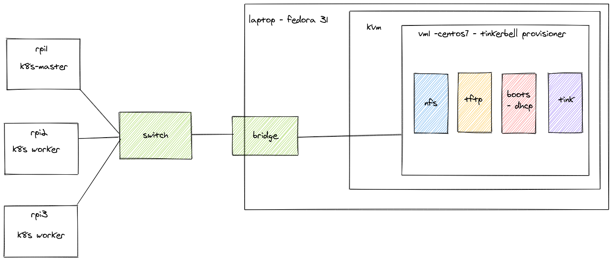

# Configuring Kubernetes cluster using tinkerbell

This repository contains an example tinkerbell (https://tinkerbell.org/) workflow for provisioning k8s control plane and
worker nodes on top of the raspberries pi version 4 (RPi4). 

## Introduction:

Tinkerbell is engine for provisioning bare metal servers, it helps users to build fully bootable and
operational machine from scratch. It can be used for any type of the machine from traditional 
x86_64 servers to arm based single-board computers. This repository contains step by step instruction, how 
leverage tinkerbell provisioning engine to build fully operational k8s cluster. It is assumed some familiarity 
with tinkerbell concepts in the below instruction. 

## Preparation:
### Setting local environment
In order to install tinkerbell locally we need to setup a virtual machine or a dedicated bare metal server. 
In the presented example the following setup was created: 



The lab consist of:
1) KVM+QEMU hypervisor running on top of fedora 31
1) Centos 7 virtual machine hosting tinkerbell provisioner
1) Raspberries Pies version 4 workers

#### Configure hypervisor network
In order to ensure flawless communication between RPi4 - host- vm, it is required to first setup a bridge 
in the host. In the fedora31 it can be achieved as follows: 
```bash
sudo nmcli con add ifname packet type bridge con-name packet
sudo ip addr add <ip addr> dev packet
sudo ip link  set up dev packet
sudo nmcli con add type bridge-slave ifname <hv lan interface> master packet
sudo sysctl -w .net.ipv4.conf.packet.bc_forwarding=1
sudo sysctl -w net.ipv4.ip_forward=1
sudo sysctl -w net.bridge.bridge-nf-call-iptables=0
```
**Note:** Adjust the above configuration to your host. The listed kernel parameters are used to allow forwarding of dhcp
request to virtual machine.

#### Create virtual machine
Ensure virtual machine is connected to the previously created bridge and it does not block traffic for http, https, dhcp, bootpc, tftp, nfs, mountd, rpc-bind.\
On centos 7 as root:  
```bash
firewall-cmd --permanent --add-service nfs3
firewall-cmd --permanent --add-service mountd
firewall-cmd --permanent --add-service rpc-bind
firewall-cmd --permanent --add-service tftp
firewall-cmd --permanent --add-service dhcp
firewall-cmd --permanent --add-port 68/udp
firewall-cmd --permanent --add-service http
firewall-cmd --permanent --add-service https
```

Optionally if you are planning on making provisioner a gateway for rpi4, configure NAT:
```bash
sysctl -w net.ipv4.ip_forward=1
firewall-cmd --permanent --direct --passthrough ipv4 -t nat -I POSTROUTING -o eth0 -j MASQUERADE -s <rpi4 subnet>
firewall-cmd --reload
```

#### Prepare raspberries pies
Take them out of the box.

## Installation and configuration of the provisioner and RPi4
### Install tinkerbell
Connect to the virtual machine and follow steps from https://tinkerbell.org/setup/packet/provisioner/ .
At the end of installation, `envrc` file should be created, note its location.\
Replace `vmlinuz-aarch64` and `initramfs-aarch64` with the ones from:
```bash
wget -O /var/tinkerbell/nginx/misc/osie/current/vmlinuz-aarch64  https://storage.googleapis.com/rpi4-uefi-tinkerbell/vmlinuz-aarch64
wget -O /var/tinkerbell/nginx/misc/osie/current/initramfs-aarch64 https://storage.googleapis.com/rpi4-uefi-tinkerbell/initramfs-aarch64
```

It is a custom build kernel and initramfs for rpi4 to execute a workflow. The difference from the standard osie, is that workflow
is directly executed in the initramfs stage. The kernel was build to execute workflow contained in this repository, it is possible
it won't work with other workflows.
   
### Raspberry Pi

Install rpi4 uefi (https://rpi4-uefi.dev/) onto sd card,  use the prepared image:

```bash
wget -O rpi4-uefi.img https://storage.googleapis.com/rpi4-uefi-tinkerbell/rpi4-uefi.img
dd if=worker/rpi4-uefi.img of=/dev/mmcblk0 #replace it according to your sd card device
```

When booting rpi4 for the first time you have to change boot order to boot from pxe.

 **Note:** If you decide to use upstream rpi4-uefi image, make sure that it is using `device tree`. The option in 
 question can be found in the uefi menu under: `Device Manager` → `Raspberry Pi Configuration` → `Advanced Configuration`
 
 ## Configure workflows
 Workflow is a set of task which are executed in order and are used to configure the bare metal machine. 
 Each of the task is executed in th separate docker container. All task are supervised by a tink-worker, which
 gathers logs, communicates with external services and handles errors.
 ### Prepare workflow
 Since workflows are executed in-memory on raspberry pi, it is required ensure tink-worker and fluent-bit support that architecture, at the time 
 of writing tink-worker was not available, but we prepared one for you, you can pull it from here:
 ```bash
docker pull ottovsky/tink-worker:armv7-latest
docker pull fluent/fluent-bit:arm32v7-1.3.8
```
Once pulled, tag it with your ${TINKERBELL_HOST_IP} registry and push it:
````bash
docker tag ottovsky/tink-worker:armv7-latest ${TINKERBELL_HOST_IP}/tink-worker:armv7
docker tag fluent/fluent-bit:arm32v7-1.3.8  ${TINKERBELL_HOST_IP}/fluent-bit:1.3-arm
docker push ${TINKERBELL_HOST_IP}/tink-worker:armv7
${TINKERBELL_HOST_IP}/fluent-bit:1.3-arm
````

Next follow instructions from workflow directory.

### Create workflow
1) Source `envrc`
1) Register raspberries pies hardware in tinkerbell
    ```bash
    cat templates/hw.json | envsubst UUID="$(uuidgen)" IP="<desired ip>" MASK="255.255.255.0" GW="<desired gw ip>" MAC="<mac of RPi>" HOSTNAME="<desire hostname>" > device.json
    docker cp device.json deploy_tink-cli_1:/root
    docker exec -ti deploy_tink-cli_1 tink hardware push --file /root/device.json
    ```
   Example output after all RPi were registered:
   ````bash
    docker exec -ti deploy_tink-cli_1 tink hardware all
    {"id": "5156f2b7-b0bc-403d-a3f7-5a2db8a40918", "arch": "aarch64", "hostname": "master-1", "allow_pxe": true, "ip_addresses": [{"address": "192.168.2.35", "netmask": "255.255.255.0", "address
    _family": 4}], "network_ports": [{"data": {"mac": "dc:a6:32:7a:28:91"}, "name": "eth0", "type": "data"}], "allow_workflow": true}
    {"id": "e247beba-0a29-4f76-91f5-c74e89b8b74d", "arch": "aarch64", "hostname": "worker-1", "allow_pxe": true, "ip_addresses": [{"address": "192.168.2.36", "netmask": "255.255.255.0", "address
    _family": 4}], "network_ports": [{"data": {"mac": "dc:a6:32:7a:2a:65"}, "name": "eth0", "type": "data"}], "allow_workflow": true}
    {"id": "9f26de7a-3149-4833-a453-8a73e95a1d53", "arch": "aarch64", "hostname": "worker-2", "allow_pxe": true, "ip_addresses": [{"address": "192.168.2.37", "netmask": "255.255.255.0", "address
    _family": 4}], "network_ports": [{"data": {"mac": "dc:a6:32:7a:29:e1"}, "name": "eth0", "type": "data"}], "allow_workflow": true}
   ````
   
   **Note:** `"facility_code": "onprem initrd=initramfs-aarch64 #"` is a workaround to disable `console` and to ensure proper boot of kernel. 
   We are leveraging the absence of sanity check in the `boots` component: https://github.com/tinkerbell/boots/blob/master/installers/osie/main.go#L90 .

1) Create templates
    ```bash
    export SSID=<wifi ssid>
    export PSK=<wifi psk>
    export COUNTRY=<wifi country>
    export SECRET=<k8s secret>
    export K3S="https://<master ip>:6443 
    cat templates/workflow-master.tmpl | envsubst > k8s-master.tmpl
    cat templates/workflow-worker.tmpl | envsubst > k8s-worker.tmpl
    docker cp k8s-master.tmpl deploy_tink-cli_1:/root
    docker cp k8s-worker.tmpl deploy_tink-cli_1:/root
    docker exec -ti deploy_tink-cli_1 tink template create -n k8s-master -p /root/k8s-master.tmpl
    docker exec -ti deploy_tink-cli_1 tink template create -n k8s-worker -p /root/k8s-worker.tmpl
    ```
    Note down the returned ids of the templates. \
    Example output of created templates:
    ```bash
    docker exec -ti deploy_tink-cli_1 tink template list
    +--------------------------------------+---------------+-------------------------------+-------------------------------+
    | TEMPLATE ID                          | TEMPLATE NAME | CREATED AT                    | UPDATED AT                    |
    +--------------------------------------+---------------+-------------------------------+-------------------------------+
    | 4c4deca8-7e80-4518-9729-4874a166a729 | k8s-master    | 2020-05-07 08:07:31 +0000 UTC | 2020-05-07 08:07:31 +0000 UTC |
    | b6fa353b-d20e-434d-9652-4ebe5231257b | k8s-worker    | 2020-05-07 08:05:57 +0000 UTC | 2020-05-07 08:05:57 +0000 UTC |
    +--------------------------------------+---------------+-------------------------------+-------------------------------+
    ```

1) Create workflows, in orderd to this, it is required to assign template id with target id.
    ```bash
    docker exec -ti deploy_tink-cli_1 tink workflow create -t <template id> -r '{"device_1": "<ip of the taget device>"}'
    ```
    In this step, you decide what role should be assigned to RPi. for example if you would like one RPi to be k8s master, 
    you have to assign targeted hardware IP to the k8s-master template.
    Note down the workflow ids.

 ## Execute workflow
 
 Insert empty sd card to the raspberry pi and power it up. Wait till the workflow is executed:
 ```bash
docker exec -ti deploy_tink-cli_1 tink workflow events <workflow id> 
+--------------------------------------+------------------+--------------+----------------+---------------------------------+--------------------+
| WORKER ID                            | TASK NAME        | ACTION NAME  | EXECUTION TIME | MESSAGE                         |      ACTION STATUS |
+--------------------------------------+------------------+--------------+----------------+---------------------------------+--------------------+
| 5156f2b7-b0bc-403d-a3f7-5a2db8a40918 | k8s-installation | disk-wipe    |              0 | Started execution               | ACTION_IN_PROGRESS |
| 5156f2b7-b0bc-403d-a3f7-5a2db8a40918 | k8s-installation | disk-wipe    |             11 | Finished Execution Successfully |     ACTION_SUCCESS |
| 5156f2b7-b0bc-403d-a3f7-5a2db8a40918 | k8s-installation | os-install   |              0 | Started execution               | ACTION_IN_PROGRESS |
| 5156f2b7-b0bc-403d-a3f7-5a2db8a40918 | k8s-installation | os-install   |            501 | Finished Execution Successfully |     ACTION_SUCCESS |
| 5156f2b7-b0bc-403d-a3f7-5a2db8a40918 | k8s-installation | os-configure |              0 | Started execution               | ACTION_IN_PROGRESS |
| 5156f2b7-b0bc-403d-a3f7-5a2db8a40918 | k8s-installation | os-configure |              3 | Finished Execution Successfully |     ACTION_SUCCESS |
| 5156f2b7-b0bc-403d-a3f7-5a2db8a40918 | k8s-installation | install-k8s  |              0 | Started execution               | ACTION_IN_PROGRESS |
| 5156f2b7-b0bc-403d-a3f7-5a2db8a40918 | k8s-installation | install-k8s  |             19 | Finished Execution Successfully |     ACTION_SUCCESS |
| 5156f2b7-b0bc-403d-a3f7-5a2db8a40918 | k8s-installation | reboot       |              0 | Started execution               | ACTION_IN_PROGRESS |
| 5156f2b7-b0bc-403d-a3f7-5a2db8a40918 | k8s-installation | reboot       |             14 | Finished Execution Successfully |     ACTION_SUCCESS |
+--------------------------------------+------------------+--------------+----------------+---------------------------------+--------------------+

```

Once the workflow finished, the RPi should be an operational k8s master/worker node.